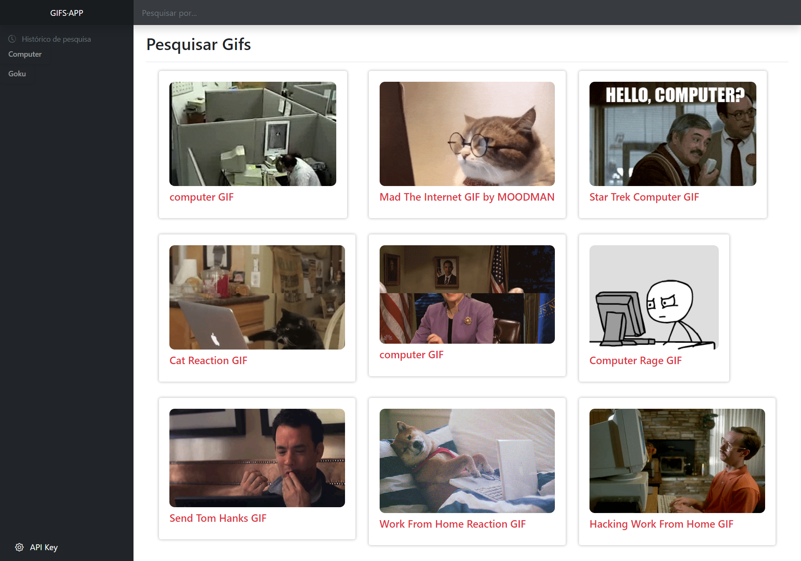

# Gifs-App

Resultado dos meus primeiros passos com o [Angular](https://angular.io/). 
Trata-se de um projeto simples para pesquisa de Gifs animados, utilizando o serviço de API da plataforma https://giphy.com/

### Para executar:

1. Criar uma conta Developer na Giphy.com e gerar uma API KEY;
2. Clonar este projeto em sua máquina: ```https://github.com/e-evaristo/Gifs-App.git```
3. Entrar no diretório: ```cd gifs-app```
4. Instalar as dependências: ```npm install```
4. Executar `ng serve -o`

O aplicativo será aberto no seu navegador. 

### Tela do aplicativo 


